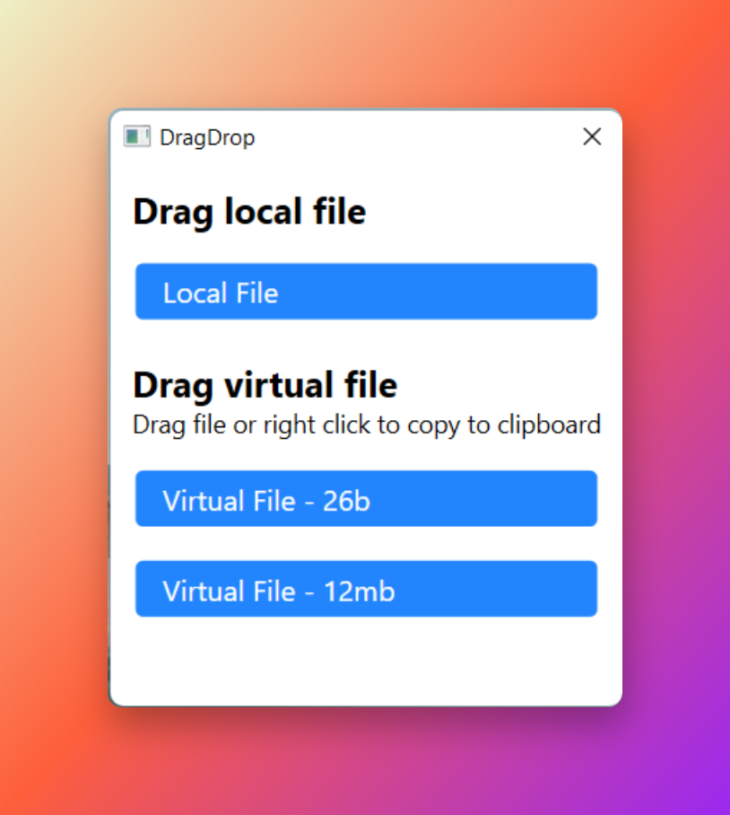

# VirtualDragDrop
A test project for trying virtual / remote and local file (with thumbnail) drag and drop to Windows Explorer or third party apps

It uses code from David Anson's 2009 blog https://dlaa.me/blog/post/9923072

  

