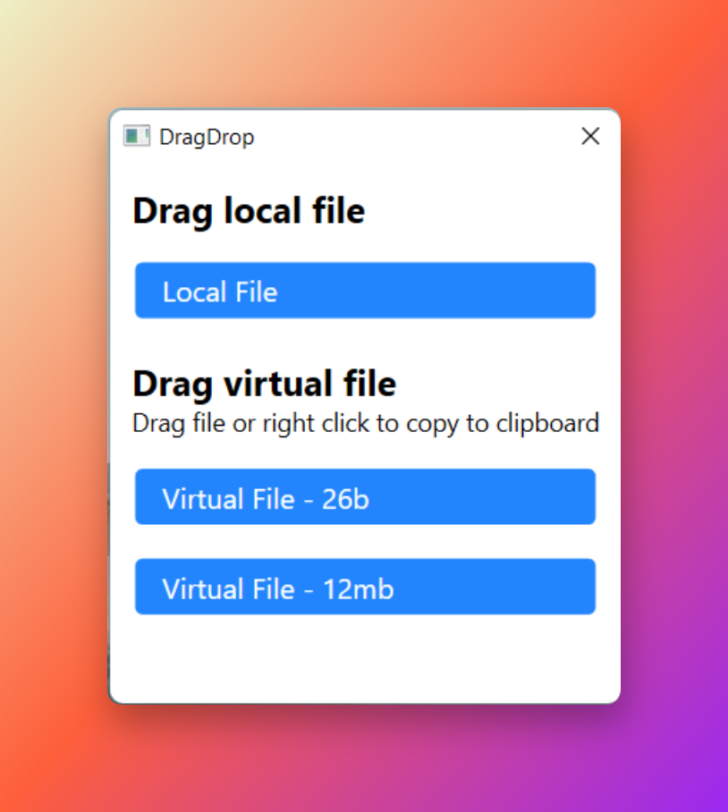

# VirtualDragDrop
Test project tries to dempnstrate drag & drop of local and remote/virtual files to windows explorer or third party apps.

It uses code from David Anson's 2009 blog https://dlaa.me/blog/post/9923072

